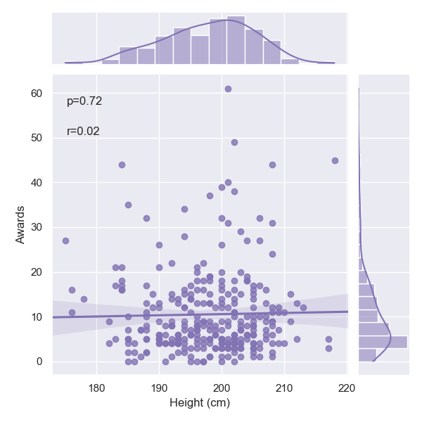
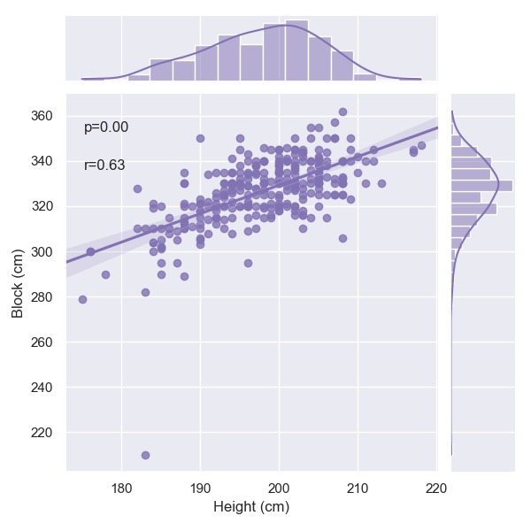
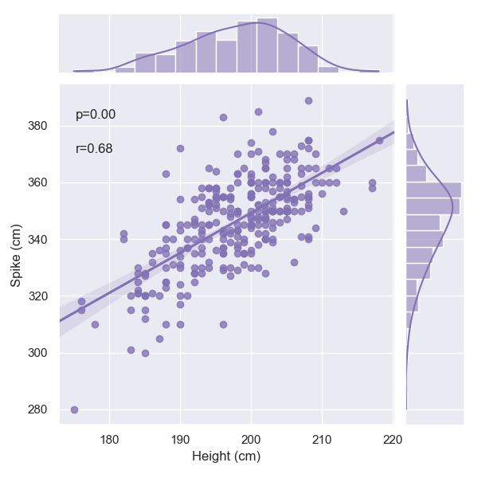
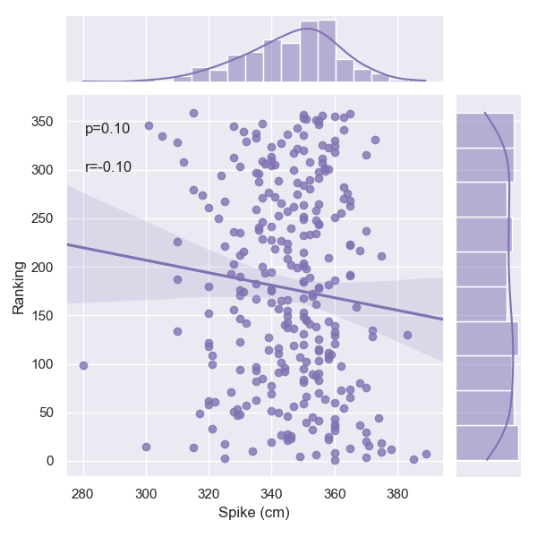
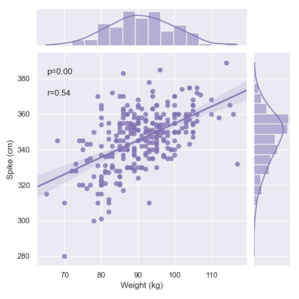
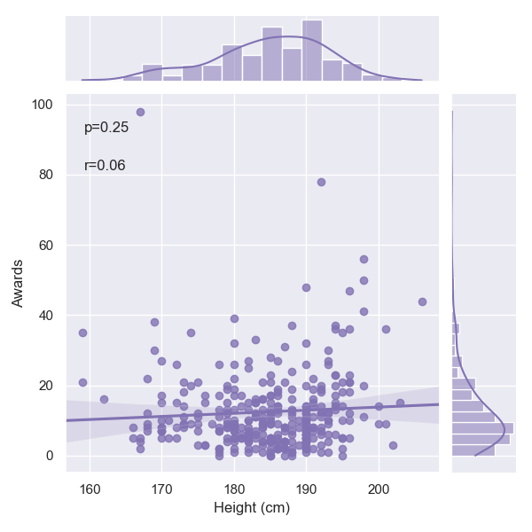
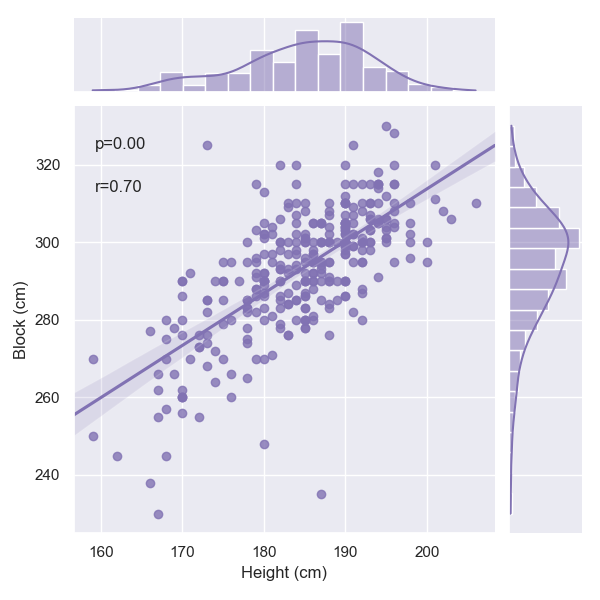
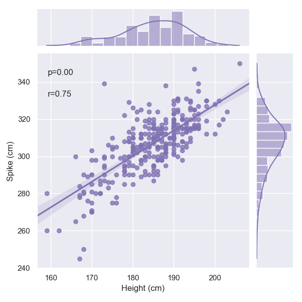
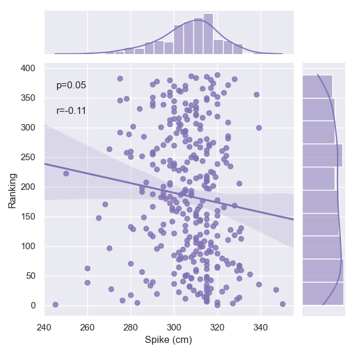
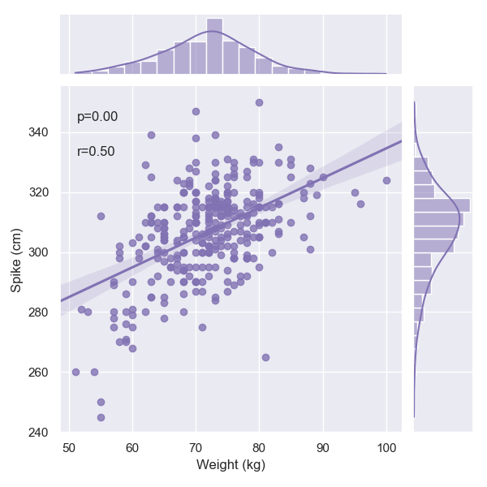

# Summary

@justin todo

# Analysis Summary

@justing todo

# Statistics

## Men
Pearson Correlation Coefficients with 'Ranking':

- Weight (kg)    0.020951
- Height (cm)   -0.027348
- Spike (cm)    -0.097174
- Block (cm)    -0.021851
- Points        -0.861837
- Awards        -0.545644
- Matches       -0.252201
- Tournaments   -0.517341
- Position       0.022789

Coefficient of Determination (R^2) with 'Ranking':

- Weight (kg)    0.000439
- Height (cm)    0.000748
- Spike (cm)     0.009443
- Block (cm)     0.000477
- Points         0.742763
- Awards         0.297727
- Matches        0.063605
- Tournaments    0.267642
- Position       0.000519

T-test for 2 vs 1 - Height (cm):
T-statistic: 4.97299655917408, P-value: 1.8746142113377633e-06
--------------------------------------------------
T-test for 2 vs 5 - Height (cm):
T-statistic: 13.717999294802523, P-value: 7.12934490534508e-24
--------------------------------------------------
T-test for 2 vs 3 - Height (cm):
T-statistic: -3.305245645118848, P-value: 0.0012572350345596392
--------------------------------------------------
T-test for 2 vs 4 - Height (cm):
T-statistic: 8.193254520721965, P-value: 7.771904884269295e-13
--------------------------------------------------
T-test for 1 vs 5 - Height (cm):
T-statistic: 12.101924875703483, P-value: 1.4035962845389327e-22
--------------------------------------------------
T-test for 1 vs 3 - Height (cm):
T-statistic: -9.890669213388287, P-value: 5.068529948948897e-18
--------------------------------------------------
T-test for 1 vs 4 - Height (cm):
T-statistic: 5.0893608736011595, P-value: 1.20929173885892e-06
--------------------------------------------------
T-test for 5 vs 3 - Height (cm):
T-statistic: -20.32129614554723, P-value: 9.89363585932589e-37
--------------------------------------------------
T-test for 5 vs 4 - Height (cm):
T-statistic: -6.1494691196566915, P-value: 2.789922408621998e-08
--------------------------------------------------
T-test for 3 vs 4 - Height (cm):
T-statistic: 13.296533780076034, P-value: 1.7590444608451152e-24
--------------------------------------------------
T-test for 2 vs 1 - Weight (kg):
T-statistic: 4.86878600760868, P-value: 2.9539272518048868e-06
--------------------------------------------------
T-test for 2 vs 5 - Weight (kg):
T-statistic: 11.39518674770878, P-value: 3.2603600227285386e-19
--------------------------------------------------
T-test for 2 vs 3 - Weight (kg):
T-statistic: -0.3205703299948379, P-value: 0.749103028976096
--------------------------------------------------
T-test for 2 vs 4 - Weight (kg):
T-statistic: 8.124862431065733, P-value: 1.0946329998042751e-12
--------------------------------------------------
T-test for 1 vs 5 - Weight (kg):
T-statistic: 7.664390381699261, P-value: 4.984136130597311e-12
--------------------------------------------------
T-test for 1 vs 3 - Weight (kg):
T-statistic: -4.922074803186746, P-value: 2.2578665834921376e-06
--------------------------------------------------
/Users/joelramirez/Documents/GitHub/justin_project/analysis.py:55: RuntimeWarning: More than 20 figures have been opened. Figures created through the pyplot interface (`matplotlib.pyplot.figure`) are retained until explicitly closed and may consume too much memory. (To control this warning, see the rcParam `figure.max_open_warning`). Consider using `matplotlib.pyplot.close()`.
  plt.figure(figsize=(10, 6))
T-test for 1 vs 4 - Weight (kg):
T-statistic: 4.115563909245525, P-value: 6.761805057853825e-05
--------------------------------------------------
T-test for 5 vs 3 - Weight (kg):
T-statistic: -10.248781859047513, P-value: 3.8948492482892944e-17
--------------------------------------------------
T-test for 5 vs 4 - Weight (kg):
T-statistic: -3.5646971273357164, P-value: 0.0006143691034932662
--------------------------------------------------
T-test for 3 vs 4 - Weight (kg):
T-statistic: 7.591552474183524, P-value: 1.195340517994401e-11
--------------------------------------------------

# Women
Pearson Correlation Coefficients with 'Ranking':

Weight (kg)   -0.038913
Height (cm)   -0.074631
Spike (cm)    -0.109981
Block (cm)    -0.082618
Points        -0.834776
Awards        -0.575080
Matches       -0.158350
Tournaments   -0.568597
Position       0.031101
Name: Ranking, dtype: float64

Coefficient of Determination (R^2) with 'Ranking':

Weight (kg)    0.001514
Height (cm)    0.005570
Spike (cm)     0.012096
Block (cm)     0.006826
Points         0.696852
Awards         0.330717
Matches        0.025075
Tournaments    0.323303
Position       0.000967
Name: Ranking, dtype: float64

--------------------------------------------------

T-test for 1.0 vs 5.0 - Height (cm):
T-statistic: 12.57982813332406, P-value: 4.294823802273973e-25
--------------------------------------------------
T-test for 1.0 vs 2.0 - Height (cm):
T-statistic: -3.398248531014167, P-value: 0.0008547774958471212
--------------------------------------------------
T-test for 1.0 vs 4.0 - Height (cm):
T-statistic: 5.116430941057016, P-value: 9.515277147805331e-07
--------------------------------------------------
T-test for 1.0 vs 3.0 - Height (cm):
T-statistic: -5.3354453063795235, P-value: 2.7217895195821047e-07
--------------------------------------------------
T-test for 5.0 vs 2.0 - Height (cm):
T-statistic: -13.680505267101617, P-value: 6.740749925494206e-24
--------------------------------------------------
T-test for 5.0 vs 4.0 - Height (cm):
T-statistic: -6.5870222883457465, P-value: 4.551145224050135e-09
--------------------------------------------------
T-test for 5.0 vs 3.0 - Height (cm):
T-statistic: -18.844221517149567, P-value: 1.6045192556817484e-37
--------------------------------------------------
T-test for 2.0 vs 4.0 - Height (cm):
T-statistic: 7.115072931267415, P-value: 2.2818928484618244e-10
--------------------------------------------------
T-test for 2.0 vs 3.0 - Height (cm):
T-statistic: -0.8559339349641559, P-value: 0.39357374537986
--------------------------------------------------
T-test for 4.0 vs 3.0 - Height (cm):
T-statistic: -10.149863790222557, P-value: 7.505498143179844e-18
--------------------------------------------------
T-test for 1.0 vs 5.0 - Weight (kg):
T-statistic: 8.556497693931451, P-value: 1.4117947598651454e-14
--------------------------------------------------
T-test for 1.0 vs 2.0 - Weight (kg):
T-statistic: -1.8404357262502284, P-value: 0.06754524576440227
--------------------------------------------------
T-test for 1.0 vs 4.0 - Weight (kg):
T-statistic: 2.3054204082101375, P-value: 0.022532462872644925
--------------------------------------------------
T-test for 1.0 vs 3.0 - Weight (kg):
T-statistic: -4.409410914525241, P-value: 1.7413477868574675e-05
--------------------------------------------------
T-test for 5.0 vs 2.0 - Weight (kg):
T-statistic: -7.85839570730879, P-value: 7.087378581733802e-12
--------------------------------------------------
T-test for 5.0 vs 4.0 - Weight (kg):
T-statistic: -5.429066517677247, P-value: 6.05499102704844e-07
--------------------------------------------------
/Users/joelramirez/Documents/GitHub/justin_project/analysis.py:55: RuntimeWarning: More than 20 figures have been opened. Figures created through the pyplot interface (`matplotlib.pyplot.figure`) are retained until explicitly closed and may consume too much memory. (To control this warning, see the rcParam `figure.max_open_warning`). Consider using `matplotlib.pyplot.close()`.
  plt.figure(figsize=(10, 6))
T-test for 5.0 vs 3.0 - Weight (kg):
T-statistic: -11.148406299169165, P-value: 3.362807261918677e-20
--------------------------------------------------
T-test for 2.0 vs 4.0 - Weight (kg):
T-statistic: 3.200834779607996, P-value: 0.0018754155166603049
--------------------------------------------------
T-test for 2.0 vs 3.0 - Weight (kg):
T-statistic: -1.6202504880208946, P-value: 0.10754711854619492
--------------------------------------------------
T-test for 4.0 vs 3.0 - Weight (kg):
T-statistic: -5.575254111834187, P-value: 1.548239877020142e-07

## Figures

### Men

_by_position.png)

_by_position.png)

### Women

_by_position.png)

_by_position.png)

### General

_by_position.png)

_by_position.png)
